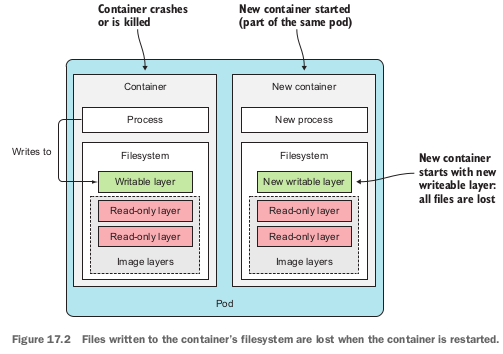
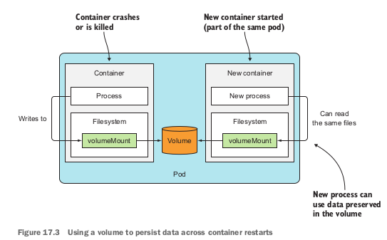
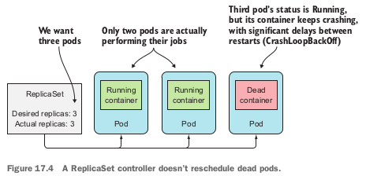
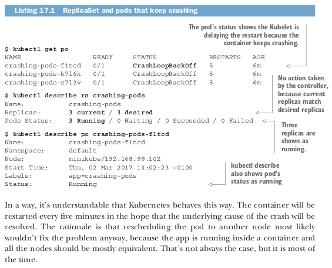
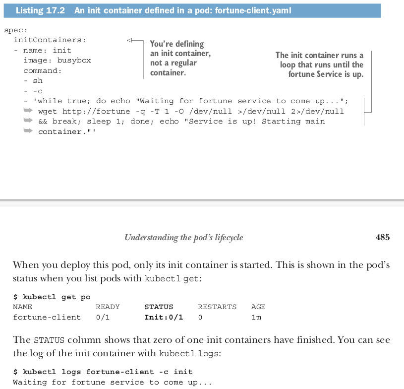
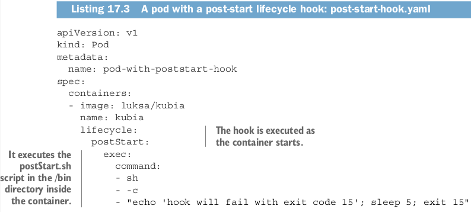
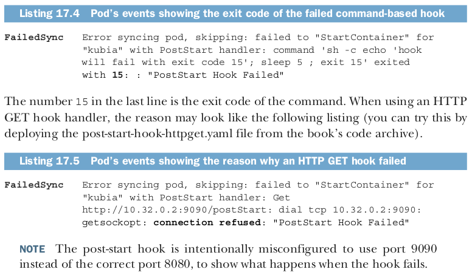
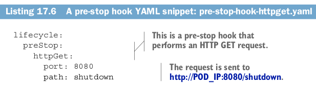
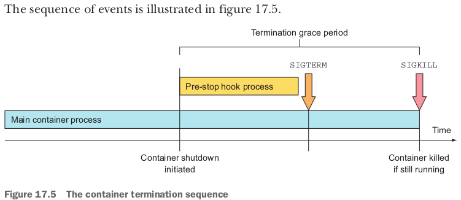
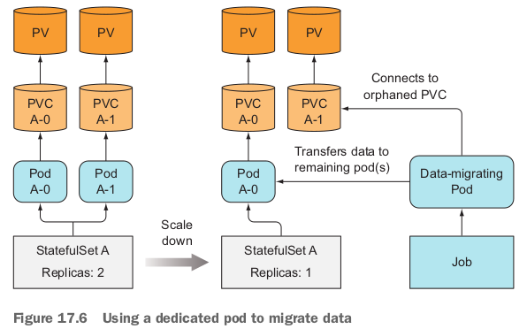

# Understanding the pod’s lifecycle
We’ve said that pods can be compared to VMs dedicated to running only a single
application. Although an application running inside a pod is not unlike an application running in a VM, significant differences do exist. One example is that **apps running in a pod can be killed any time**, because **Kubernetes needs to relocate the pod to another node for a reason or because of a scale-down request**. We’ll explore this aspect next.

## 1 Applications must expect to be killed and relocated
Outside Kubernetes, apps running in VMs are seldom moved from one machine to
another. When an operator moves the app, they can also reconfigure the app and
manually check that the app is running fine in the new location. With Kubernetes, apps are relocated much more frequently and automatically—no human operator reconfigures them and makes sure they still run properly after the move. This means application developers need to **make sure their apps allow being moved relatively often**.

### 1.1 EXPECTING THE LOCAL IP AND HOSTNAME TO CHANGE
When a pod is killed and run elsewhere (technically, it’s a new pod instance replacing the old one; the pod isn’t relocated), it not only has a new IP address but also a
new name and hostname. Most stateless apps can usually handle this without any
adverse effects, but stateful apps usually can’t. We’ve learned that stateful apps can be run through a **StatefulSet**, which **ensures that when the app starts up on a new node after being rescheduled**, **it will still see the same host name and persistent state as before**. The pod’s IP will change nevertheless. Apps need to be prepared for that to happen. The application developer therefore should never base membership in a clustered app on the member’s IP address, and if basing it on the hostname, should
always use a StatefulSet.
### 1.2 EXPECTING THE DATA WRITTEN TO DISK TO DISAPPEAR
Another thing to keep in mind is that **if the app writes data to disk, that data may not be available after the app is started inside a new pod**, **unless you mount persistent storage at the location the app is writing to**. 

It should be clear this happens when the pod is rescheduled, but files written to disk will disappear even in scenarios that don’t involve any rescheduling. Even during the lifetime of a single pod, the files written to disk by
the app running in the pod may disappear. 

Let me explain this with an example:
Imagine an app that has a long and computationally intensive initial startup proce-
dure. To help the app come up faster on subsequent startups, the developers make
the app cache the results of the initial startup on disk (an example of this would be
the scanning of all Java classes for annotations at startup and then writing the results
to an index file). Because apps in Kubernetes run in containers by default, these files
are written to the container’s filesystem. If the container is then restarted, they’re all
lost, because the new container starts off with a completely new writable layer (see fig-
ure 17.2).
Don’t forget that individual containers may be restarted for several reasons, such
as because the process crashes, because the liveness probe returned a failure, or
because the node started running out of memory and the process was killed by the
OOMKiller. When this happens, the **pod is still the same, but the container itself is completely new**. The Kubelet doesn’t run the same container again; it **always creates a new container.**
### 1.3 USING VOLUMES TO PRESERVE DATA ACROSS CONTAINER RESTARTS
When its container is restarted, the app in the example will need to perform the
intensive startup procedure again. This may or may not be desired. To make sure data
like this isn’t lost, you need to use at least a pod-scoped volume. Because volumes live
and die together with the pod, the new container will be able to reuse the data written
to the volume by the previous container (figure 17.3).





Using a volume to preserve files across container restarts is a great idea sometimes, **but not always**.

**What if the data gets corrupted and causes the newly created process to crash again?**

This will result in a **continuous crash loop** (the pod will show the
**CrashLoopBackOff** status). If you hadn’t used a volume, the new container would start from scratch and most likely not crash. Using volumes to preserve files across container restarts like this is a double-edged sword. You **need to think carefully about whether to use them or not**.
## 2. Rescheduling of dead or partially dead pods
**If a pod’s container keeps crashing**, the **Kubelet will keep restarting it indefinitely.**

**The time between restarts will be increased exponentially until it reaches five minutes.**

**During** those **five minute intervals**, the **pod is essentially dead**, because **its container’s process isn’t running**. 

To be fair, **if it’s a multi-container pod**, certain containers may be running normally, so the **pod is only partially dead**. 

But if a pod contains only a **single container**, the **pod is effectively dead and completely useless**, because no process is running in it anymore.

You may find it surprising to learn that such **pods aren’t automatically removed and rescheduled**, **even if they’re part of a ReplicaSet or similar controller**.

If you create a ReplicaSet with a desired replica count of **three**, and then **one of the containers in one of those pods starts crashing**, Kubernetes will not delete and replace the pod. The end result is a ReplicaSet with **only** **two** properly running replicas instead of the desired three (figure 17.4).



You’d probably expect the pod to be deleted and replaced with another pod instance
that might run successfully on another node. After all, the container may be crashing
because of a node-related problem that doesn’t manifest itself on other nodes. Sadly,
that isn’t the case. The ReplicaSet controller doesn’t care if the pods are dead—all it cares about is that the number of pods matches the desired replica count, which in
this case, it does.
If you’d like to see for yourself, I’ve included a YAML manifest for a ReplicaSet
whose pods will keep crashing (see file replicaset-crashingpods.yaml in the code
archive). If you create the ReplicaSet and inspect the pods that are created, the follow-
ing listing is what you’ll see.



In a way, it’s understandable that Kubernetes behaves this way. The container will be restarted every five minutes in the hope that the underlying cause of the crash will be resolved. The rationale is that rescheduling the pod to another node most likely wouldn’t fix the problem anyway, because the app is running inside a container and all the nodes should be mostly equivalent. That’s **not always the case, but it is most of the time**.
## 3. Starting pods in a specific order
One other difference between apps running in pods and those managed manually is
that the ops person deploying those apps knows about the dependencies between
them. This allows them to start the apps in order.
### 3.1 UNDERSTANDING HOW PODS ARE STARTED
When you use Kubernetes to run your multi-pod applications, you don’t have a built-in way to tell Kubernetes to run certain pods first and the rest only when the first pods are already up and ready to serve. Sure, you could post the manifest for the first app and then wait for the pod(s) to be ready before you post the second manifest, but your whole system is usually defined in a single YAML or JSON containing multiple Pods, Services, and other objects.
The Kubernetes API server does process the objects in the YAML/JSON in the
order they’re listed, but this only means they’re written to etcd in that order. You have no guarantee that pods will also be started in that order.
**But you can prevent a pod’s main container from starting until a precondition is met**. This is done by **including an init containers in the pod**.
### 3.2 INTRODUCING INIT CONTAINER
In addition to regular containers, pods can also include **init containers**. As the name suggests, **they can be used to initialize the pod—this often means writing data to the pod’s volumes**, which are **then mounted into the pod’s main container(s)**.

A pod **may have any number of init containers**. They’re executed **sequentially** and **only after the last one completes** are the pod’s main containers started. 

This means init containers can also be used to **delay** the start of the **pod’s main container(s)**

for example, **1.** until a certain precondition is met. An **init container** could **wait for a service required by the pod’s main container to be up and ready**. **2.** When it is, the **init container terminates and allows the main container(s) to be started**.
This way, the **main container wouldn’t use the service before it’s ready**.

Let’s look at an **example** of a pod using an init container to **delay the start of the main container**. 
A web server that returns a fortune quote as a response to client requests. Now, let’s imagine you have **a fortune-client pod that requires the fortune Service to be up and running before its main container starts**. You can add an **init container**, which c**hecks whether the Service is responding to requests**. **Until that’s the case**, the **init container keeps retrying**. **Once it gets a response**, the **init container terminates and lets the main container start**.
### 3.3 ADDING AN INIT CONTAINER TO A POD
Init containers can be defined in the pod spec like main containers but through the spec.initContainers field. You’ll find the complete YAML for the fortune-client pod in the book’s code archive. The following listing shows the part where the init container is defined.



When running the kubectl logs command, you need to specify the name of the init
container with the -c switch (in the example, the name of the pod’s init container is
init , as you can see in listing 17.2).
The main container won’t run until you deploy the fortune Service and the
fortune-server pod. You’ll find them in the fortune-server.yaml file.

### 3.4 BEST PRACTICE FOR HANDLING INTER-POD DEPENDENCIES
You’ve seen how an init container can be used to delay starting the pod’s main container(s) until a precondition is met (making sure the Service the pod depends on is ready, for example), but it’s **much better to write apps that don’t require every service they rely on to be ready before the app starts up**. After all, the **service may also go offline later**, **while the app is already running.** 

The application needs to handle internally the possibility that its dependencies aren’t ready. And **don’t forget readiness probes**. 

If an app can’t do its job because one of its dependencies is missing, it should signal that through its **readiness probe**, so Kubernetes knows it, too, isn’t ready. You’ll want to do this not only because it prevents the app from being added as a service endpoint, but also because the app’s **readiness is also used by the Deployment controller when performing a rolling update, thereby preventing a rollout of a bad version.**
## 4. Adding lifecycle hooks
We’ve talked about how init containers can be used to hook into the startup of the pod, but pods also allow you to define two lifecycle hooks:
*   **Post-start hooks**
*   **pre-stop hooks**
*   
These lifecycle hooks are specified per container, unlike init containers, which apply to the whole pod. 
As their names suggest, they’re executed when the container **starts and before it stops**.

**Lifecycle hooks are similar to liveness and readiness probes in that they can either**
*   Execute a command inside the container
*   Perform an HTTP GET request against a URL
Let’s look at the two hooks individually to see what effect they have on the container lifecycle.
### 4.1 POST-START CONTAINER LIFECYCLE HOOK
A **post-start hook is executed immediately after the container’s main process is started**. 
**You use it to perform additional operations when the application starts**. 

Sure, if you’re the **author of the application running in the container, you can always perform those operations inside the application code itself**. 

**But when you’re running an application developed by someone else, you mostly don’t want to (or can’t) modify its source code.** 

**Post-start hooks allow you to run additional commands without having to touch** the app. These may signal to an external listener that the app is starting, or they may initialize the application so it can start doing its job.
The **hook is run in parallel with the main process**. The name might be somewhat misleading, because it doesn’t wait for the main process to start up fully (if the process has an initialization procedure, the Kubelet obviously can’t wait for the procedure to complete, because it has no way of knowing when that is). But even though the hook runs asynchronously, it does affect the container in two ways. 

**Until the hook completes, the container will stay in the Waiting state with the reason ContainerCreating** . Because of this, the pod’s status will be **Pending instead of Running** . 
**If the hook fails to run or returns a non-zero exit code, the main container will be killed**. A pod manifest containing a post-start hook looks like the following listing.


In the **example**, **the echo , sleep , and exit commands are executed along with the container’s main process as soon as the container is created**. Rather than run a command like this, you’d typically run a shell script or a binary executable file stored in the container image.

Sadly, if the **process started by the hook logs to the standard output**, you **can’t see the output anywhere**. This **makes debugging lifecycle hooks painful**.

 **If the hook fails**, you’ll only see a **FailedPostStartHook** warning among the pod’s events (you can see them using kubectl describe pod ). A while later, you’ll see more information on why the hook failed, as shown in the following listing.



The standard and error outputs of command-based post-start hooks aren’t logged any-
where, so you may want to have the process the hook invokes log to a file in the con-
tainer’s filesystem, which will allow you to examine the contents of the file with
something like this:
**$ kubectl exec my-pod cat logfile.txt**
If the container gets restarted for whatever reason (including because the hook failed), the file may be gone before you can examine it. You can work around that by mounting an emptyDir volume into the container and having the hook write to it.
### 4.2 PRE-STOP CONTAINER LIFECYCLE HOOK
A pre-stop hook is executed **immediately before a container is terminated**. 

When a container needs to be terminated, the **Kubelet** will run the pre-stop hook, if configured, and only then send a SIGTERM to the process (and later kill the process if it doesn’t terminate gracefully).

A **pre-stop hook** can be **used to initiate a graceful shutdown** of the container, if it doesn’t shut down gracefully upon receipt of a SIGTERM signal. They can also be used to perform arbitrary operations before shutdown without having to implement those operations in the application itself (this is useful when you’re running a third-party app, whose source code you don’t have access to and/or can’t modify). 

Configuring a pre-stop hook in a pod manifest isn’t very different from adding a post-start hook. The previous example showed a post-start hook that executes a command, so we’ll look at a pre-stop hook that performs an HTTP GET request now. The following listing shows how to define a pre-stop HTTP GET hook in a pod.


The pre-stop hook defined in this listing performs an HTTP GET request to http://
POD_IP:8080/shutdown as soon as the Kubelet starts terminating the container.
Apart from the port and path shown in the listing, you can also set the fields scheme
(HTTP or HTTPS) and host , as well as httpHeaders that should be sent in the
request. The host field defaults to the pod IP. Be sure not to set it to **localhost**,
because **localhost** would **refer to the node, not the pod.**
In contrast to the post-start hook, the container will be terminated regardless of
the result of the hook—an error HTTP response code or a non-zero exit code when
using a command-based hook will not prevent the container from being terminated.
If the pre-stop hook fails, you’ll see a FailedPreStopHook warning event among the
pod’s events, but because the pod is deleted soon afterward (after all, the pod’s dele-
tion is what triggered the pre-stop hook in the first place), you may not even notice
that the pre-stop hook failed to run properly.

```
TIP
If the successful completion of the pre-stop hook is critical to the proper
operation of your system, verify whether it’s being executed at all. I’ve wit-
nessed situations where the pre-stop hook didn’t run and the developer
wasn’t even aware of that.
```
### 4.3 USING A PRE-STOP HOOK BECAUSE YOUR APP DOESN'T RECEIVE THE "SIGTERM" SIGNAL
Many developers make the mistake of defining a pre-stop hook solely to send a SIGTERM signal to their apps in the pre-stop hook. They do this because they don’t see their application receive the SIGTERM signal sent by the Kubelet. 

The reason why the signal isn’t received by the application isn’t because Kubernetes isn’t sending it, but because the **signal isn’t being passed to the app process inside the container itself**. If your container image is configured to run a shell, which in turn runs the app process, the **signal may be eaten up by the shell itself**, instead of being passed down to the child process.
In such cases, instead of adding a pre-stop hook to send the signal directly to your app, the **proper fix is to make sure the shell passes the signal to the app**. 

This **can be achieved by handling the signal in the shell script running as the main container process and then passing it on to the app**. Or you could **not configure the container image to run a shell at all** and **instead run the application binary directly**. You do this by using the **exec form of ENTRYPOINT or CMD** in the **Dockerfile**: **ENTRYPOINT ["/mybinary"]** instead of ENTRYPOINT /mybinary.

A container using the **first** form runs the mybinary executable **as its main process**,
whereas the **second** form runs a shell as the main process with the mybinary process executed as a child of the shell process.

### 4.5 UNDERSTANDING THAT LIFECYCLE HOOKS TARGET CONTAINERS, NOT PODS
As a final thought on post-start and pre-stop hooks, let me emphasize that these lifecycle hooks relate to containers, not pods. 

You **shouldn’t use a pre-stop hook for running actions that need to be performed when the pod is terminating**. 
The reason is that the pre-stop hook gets called when the container is being terminated (**most** likely because of a failed **liveness probe**). This may happen multiple times in the pod’s life-time, not only when the pod is in the process of being shut down
## 5. Understanding Pod shutdown
We’ve touched on the subject of pod termination, so let’s explore this subject in more detail and go over exactly what happens during pod shutdown. 

This is important for understanding how to cleanly shut down an application running in a pod. 
Let’s start at the beginning. A pod’s shut-down is **triggered** by the deletion of the Pod object **through the API server**. **Upon receiving** an **HTTP DELETE request**, the A**PI server doesn’t delete the object yet, but only sets a deletionTimestamp field in it**.

Pods that have the **deletionTimestamp** field set are **terminating**.
Once the **Kubelet** **notices** the **pod** **needs to be terminated**, it starts terminating **each of the pod’s containers**. 

It gives each container time to shut down gracefully, but the time is limited. That time is called the termination grace period and is configurable per pod. The timer starts as soon as the termination process starts. Then the following sequence of events is performed:
1. Run the pre-stop hook, if one is configured, and wait for it to finish.
2. Send the SIGTERM signal to the main process of the container.
3. Wait until the container shuts down cleanly or until the termination grace period runs out.
4. Forcibly kill the process with SIGKILL , if it hasn’t terminated gracefully yet.

### 5.1 SPECIFYING THE TERMINATION GRACE PERIOD
The termination grace period can be configured in the pod spec by setting the spec.
**terminationGracePeriodSeconds** field. It **defaults** to 30, which means the pod’s containers will be given 30 seconds to terminate **gracefully** before they’re killed **forcibly**.
```
TIP
You should set the grace period to long enough so your process can finish cleaning up in that time.
```
The grace period specified in the pod spec can also be overridden when deleting the
pod like this:
**$ kubectl delete po mypod --grace-period=5**

This will make the Kubelet wait five seconds for the pod to shut down cleanly. When
all the pod’s containers stop, the Kubelet notifies the API server and the Pod resource
is finally deleted. You can force the API server to delete the resource immediately,
without waiting for confirmation, by setting the grace period to zero and adding the
--force option like this:

**$ kubectl delete po mypod --grace-period=0 --force**

Be careful when using this option, **especially with pods of a StatefulSet**. The Stateful-
Set controller takes great care to never run two instances of the same pod at the same
time (two pods with the same ordinal index and name and attached to the same
PersistentVolume). By force-deleting a pod, **you’ll cause the controller to create a replacement pod without waiting for the containers of the deleted pod to shut down**. 

In other words, **two instances of the same pod might be running at the same time**, which may **cause your stateful cluster to malfunction**. 

Only **delete** **stateful** pods **forcibly** when you’re **absolutely sure the pod isn’t running anymore** or **can’t talk to the other members of the cluster** (you can be **sure** of this **when you confirm that the node that hosted the pod has failed** or **has been disconnected** from the network and can’t reconnect).

Now that you understand how containers are shut down, let’s look at it from the
application’s perspective and go over how applications should handle the shutdown
procedure.
### 5.2 IMPLEMENTING THE PROPER SHUTDOWN HANDLER IN YOUR APPLICATION
Applications should react to a SIGTERM signal by starting their shut-down procedure and terminating when it finishes. Instead of handling the SIGTERM signal, the application can be notified to shut down through a pre-stop hook. In both cases, the app then **only has a fixed amount of time to terminate cleanly.**
But what if you can’t predict how long the app will take to shut down cleanly? 

For example, imagine your app is a distributed data store. On scale-down, one of the pod instances will be deleted and therefore shut down. **In the shut-down procedure, the pod needs to migrate all its data to the remaining pods to make sure it’s not lost.**

Should the pod start migrating the data upon receiving a termination signal (through either the SIGTERM signal or through a pre-stop hook)?
**Absolutely not!** This is not recommended for at least the following two reasons:
*   A container terminating doesn’t necessarily mean the whole pod is being terminated.
*   You have no guarantee the shut-down procedure will finish before the process is killed.
This second scenario doesn’t happen only when the grace period runs out before the application has finished shutting down gracefully, but also when the node running the pod fails in the middle of the container shut-down sequence. Even if the node then starts up again, the Kubelet will not restart the shut-down procedure (it won’t even start up the container again). There are absolutely no guarantees that the pod will be allowed to complete its whole shut-down procedure.
### 5.3 REPLACING CRITICAL SHUT-DOWN PROCEDURES WITH DEDICATED SHUT-DOWN PROCEDURE PODS
How do you ensure that a critical shut-down procedure that absolutely must run to completion does run to completion (for example, to ensure that a pod’s data is migrated to other pods)?

One **solution** is for the app (upon receipt of a termination signal) to create a new Job resource that would run a new pod, whose sole job is to **migrate the deleted pod’s data to the remaining pods**. But if you’ve been paying attention, you’ll know that you have no guarantee the app will indeed manage to create the Job object every single time. What if the node fails exactly when the app tries to do that?

The **proper way to handle this problem is by having a dedicated, constantly running pod that keeps checking for the existence of orphaned data**. 
When this pod **finds the orphaned data**, it can **migrate it to the remaining pods**. 
Rather than a constantly running pod, you can also use a **CronJob** resource and **run the pod periodically**. You may think StatefulSets could help here, but they don’t. 
As you’ll remember,**scaling down a StatefulSet** leaves **PersistentVolumeClaims orphaned**, leaving the data stored on the PersistentVolume stranded. Yes, upon a subsequent scale-up, the Persistent-
Volume will be reattached to the new pod instance, but what if that scale-up never happens (or happens after a long time)? For this reason, you may want to run a data-migrating pod also when using StatefulSets (this scenario is shown in figure 17.6).
To prevent the migration from occurring during an application upgrade, the data-migrating pod could be configured to wait a while to give the stateful pod time to come up again before performing the migration.
