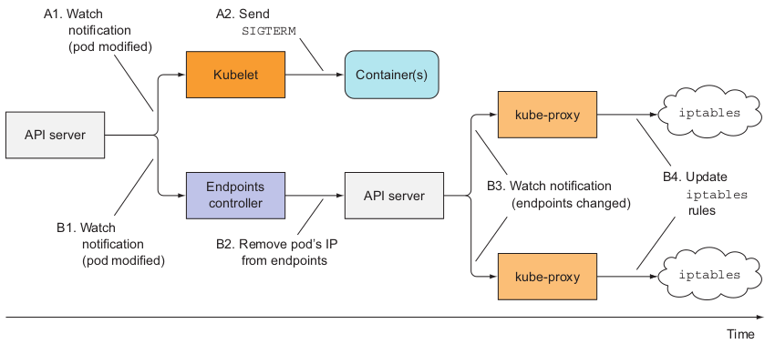

# Ensuring all client requests are handled properly
You now have a good sense of how to make pods shut down cleanly. Now, we’ll look at
the pod’s lifecycle from the perspective of the pod’s clients (clients consuming the service the pod is providing). This is important to understand if you don’t want clients to
run into problems when you scale pods up or down.
It goes without saying that you want all client requests to be handled properly. You
obviously don’t want to see broken connections when pods are starting up or shutting
down. By itself, Kubernetes doesn’t prevent this from happening. Your app needs to
follow a few rules to prevent broken connections. First, let’s focus on making sure all
connections are handled properly when the pod starts up.
## 1. Preventing broken client connections when a pod is starting up
Ensuring each connection is handled properly at pod startup is simple if you understand how Services and service Endpoints work. 
**When a pod is started, it’s added as an endpoint to all the Services**, whose label selector matches the pod’s labels. As you may remember from chapter 5, the pod also needs to signal to Kubernetes that it’s ready.
Until it is, it won’t become a service endpoint and therefore won’t receive any requests from clients.
**If you don’t specify a readiness probe in your pod spec, the pod is always considered ready.** It will start **receiving requests almost immediately—as soon as the first kube-proxy updates the iptables rules on its node and the first client pod tries to connect to the service**. **If your app isn’t ready to accept connections by then, clients will see “connection refused”** types of errors.

All you need to do is make sure that your **readiness probe returns success only
when your app is ready to properly handle incoming requests**. 
A good first step is to add an HTTP GET readiness probe and point it to the base URL of your app. In many cases that gets you far enough and saves you from having to implement a special readiness endpoint in your app.
## 2. Preventing broken connections during pod shut-down
Now let’s see what happens at the other end of a pod’s life—when the pod is deleted and
its containers are terminated. We’ve already talked about how the pod’s containers
should start shutting down cleanly as soon they receive the SIGTERM signal (or when its
pre-stop hook is executed). But does that ensure all client requests are handled properly?
How should the app behave when it receives a termination signal? Should it con-
tinue to accept requests? What about requests that have already been received but
haven’t completed yet? What about persistent HTTP connections, which may be in
between requests, but are open (when no active request exists on the connection)?
Before we can answer those questions, we need to take a detailed look at the chain of
events that unfolds across the cluster when a Pod is deleted
### 2.1 UNDERSTANDING THE SEQUENCE OF EVENTS OCCURRING AT POD DELETION
We took an in-depth look at what components make up a Kubernetes cluster. You need to always keep in mind that those components run as separate processes on multiple machines. They aren’t all part of a single big monolithic process. It takes time for all the components to be on the same page regarding the state of the cluster. Let’s explore this fact by looking at what happens across the cluster when a Pod is deleted.
When a request for a pod deletion is received by the API server, it first modifies the state in etcd and then notifies its watchers of the deletion. Among those watchers are the Kubelet and the Endpoints controller. The two sequences of events, which happen in parallel (marked with either A or B), are shown in figure 17.7

```Sequence of events that occurs when a Pod is deleted```

In the A sequence of events, you’ll see that as soon as the Kubelet receives the notifica-
tion that the pod should be terminated, it initiates the shutdown sequence as explained
in section 17.2.5 (run the pre-stop hook, send SIGTERM , wait for a period of time, and
then forcibly kill the container if it hasn’t yet terminated on its own). If the app
responds to the SIGTERM by immediately ceasing to receive client requests, any client
trying to connect to it will receive a Connection Refused error. The time it takes for
this to happen from the time the pod is deleted is relatively short because of the direct
path from the API server to the Kubelet.
Now, let’s look at what happens in the other sequence of events—the one leading
up to the pod being removed from the iptables rules (sequence B in the figure).
When the Endpoints controller (which runs in the Controller Manager in the Kuber-
netes Control Plane) receives the notification of the Pod being deleted, it removes
the pod as an endpoint in all services that the pod is a part of. It does this by modify-
ing the Endpoints API object by sending a REST request to the API server. The API
server then notifies all clients watching the Endpoints object. Among those watchers
are all the kube-proxies running on the worker nodes. Each of these proxies then
updates the iptables rules on its node, which is what prevents new connections
from being forwarded to the terminating pod. An important detail here is that
removing the iptables rules has no effect on existing connections—clients who are
already connected to the pod will still send additional requests to the pod through
those existing connections.
Both of these sequences of events happen in parallel. Most likely, the time it takes
to shut down the app’s process in the pod is slightly shorter than the time required for
the iptables rules to be updated. The chain of events that leads to iptables rules
being updated is considerably longer (see figure 17.8), because the event must first
reach the Endpoints controller, which then sends a new request to the API server, and

Timeline of events when pod is deleted

then the API server must notify the kube-proxy before the proxy finally modifies the
iptables rules. A high probability exists that the SIGTERM signal will be sent well
before the iptables rules are updated on all nodes.
The end result is that the pod may still receive client requests after it was sent the
termination signal. If the app closes the server socket and stops accepting connections
immediately, this will cause clients to receive “Connection Refused” types of errors
(similar to what happens at pod startup if your app isn’t capable of accepting connec-
tions immediately and you don’t define a readiness probe for it).
### 2.2 SOLVING THE PROBLEM
Googling solutions to this problem makes it seem as though adding a readiness probe
to your pod will solve the problem. Supposedly, all you need to do is make the readi-
ness probe start failing as soon as the pod receives the SIGTERM . This is supposed to
cause the pod to be removed as the endpoint of the service. But the removal would
happen only after the readiness probe fails for a few consecutive times (this is configu-
rable in the readiness probe spec). And, obviously, the removal then still needs to
reach the kube-proxy before the pod is removed from iptables rules.
In reality, the readiness probe has absolutely no bearing on the whole process at
all. The Endpoints controller removes the pod from the service Endpoints as soon as
it receives notice of the pod being deleted (when the deletionTimestamp field in the
pod’s spec is no longer null ). From that point on, the result of the readiness probe
is irrelevant.
What’s the proper solution to the problem? How can you make sure all requests
are handled fully?
It’s clear the pod needs to keep accepting connections even after it receives the ter-
mination signal up until all the kube-proxies have finished updating the iptables
rules. Well, it’s not only the kube-proxies. There may also be Ingress controllers or
load balancers forwarding connections to the pod directly, without going through the
Service ( iptables ). This also includes clients using client-side load-balancing. To
ensure none of the clients experience broken connections, you’d have to wait until all
of them somehow notify you they’ll no longer forward connections to the pod.
That’s impossible, because all those components are distributed across many dif-
ferent computers. Even if you knew the location of every one of them and could wait
until all of them say it’s okay to shut down the pod, what do you do if one of them
doesn’t respond? How long do you wait for the response? Remember, during that
time, you’re holding up the shut-down process.
The only reasonable thing you can do is wait for a long-enough time to ensure all
the proxies have done their job. But how long is long enough? A few seconds should
be enough in most situations, but there’s no guarantee it will suffice every time. When
the API server or the Endpoints controller is overloaded, it may take longer for the
notification to reach the kube-proxy. It’s important to understand that you can’t solve
the problem perfectly, but even adding a 5- or 10-second delay should improve the
user experience considerably. You can use a longer delay, but don’t go overboard, because the delay will prevent the container from shutting down promptly and will
cause the pod to be shown in lists long after it has been deleted, which is always frus-
trating to the user deleting the pod.
### 2.3 WRAPPING UP THIS SECTION
To recap—properly shutting down an application includes these steps:
* Wait for a few seconds, then stop accepting new connections.
* Close all keep-alive connections not in the middle of a request.
* Wait for all active requests to finish.
* Then shut down completely.
To understand what’s happening with the connections and requests during this process, examine figure 17.9 carefully.


Not as simple as exiting the process immediately upon receiving the termination sig-
nal, right? Is it worth going through all this? That’s for you to decide. But the least you
can do is add a pre-stop hook that waits a few seconds, like the one in the following
listing, perhaps.

