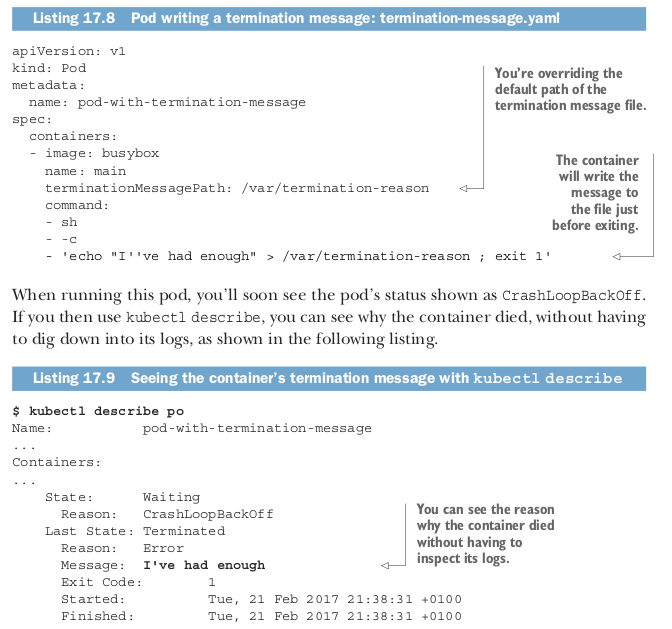
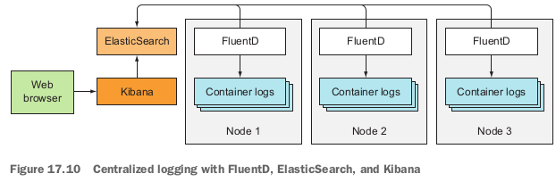

# Making your apps easy to run and manage in Kubernetes
## 1. Making manageable container images
When you package your app into an image, you can choose to include the app’s
binary executable and any additional libraries it needs, or you can package up a whole
OS filesystem along with the app. Way too many people do this, even though it’s usu-
ally unnecessary.
Do you need every single file from an OS distribution in your image? Probably not.
Most of the files will never be used and will make your image larger than it needs to
be. Sure, the layering of images makes sure each individual layer is downloaded only
once, but even having to wait longer than necessary the first time a pod is scheduled
to a node is undesirable.
Deploying new pods and scaling them should be fast. This demands having small
images without unnecessary cruft. If you’re building apps using the Go language, your
images don’t need to include anything else apart from the app’s single binary execut-
able file. This makes Go-based container images extremely small and perfect for
Kubernetes.
```
TIP
Use the FROM scratch directive in the Dockerfile for these images.
```
But in practice, you’ll soon see these minimal images are extremely difficult to debug.
The first time you need to run a tool such as ping , dig , curl , or something similar
inside the container, you’ll realize how important it is for container images to also
include at least a limited set of these tools. I can’t tell you what to include and what
not to include in your images, because it depends on how you do things, so you’ll
need to find the sweet spot yourself.

## 2. Properly tagging your images and using imagePullPolicy wisely
You’ll also soon learn that referring to the latest image tag in your pod manifests will
cause problems, because you can’t tell which version of the image each individual pod
replica is running. Even if initially all your pod replicas run the same image version, if
you push a new version of the image under the latest tag, and then pods are resched-
uled (or you scale up your Deployment), the new pods will run the new version,
whereas the old ones will still be running the old one. Also, using the latest tag
makes it impossible to roll back to a previous version (unless you push the old version
of the image again).
It’s almost mandatory to use tags containing a proper version designator instead
of latest , except maybe in development. Keep in mind that if you use mutable tags
(you push changes to the same tag), you’ll need to set the imagePullPolicy field in
the pod spec to Always . But if you use that in production pods, be aware of the big
caveat associated with it. If the image pull policy is set to Always , the container run-
time will contact the image registry every time a new pod is deployed. This slows
down pod startup a bit, because the node needs to check if the image has been mod-
ified. Worse yet, this policy prevents the pod from starting up when the registry can-
not be contacted.
## 3. Using multi-dimensional instead of single-dimensional labels
Don’t forget to label all your resources, not only Pods. Make sure you add multiple
labels to each resource, so they can be selected across each individual dimension. You
(or the ops team) will be grateful you did it when the number of resources increases.
Labels may include things like:
*  The name of the application (or perhaps microservice) the resource belongs to
*  Application tier (front-end, back-end, and so on)
*  Environment (development, QA, staging, production, and so on)
*  Version
*  Type of release (stable, canary, green or blue for green/blue deployments, and so on)
*  Tenant (if you’re running separate pods for each tenant instead of using name-spaces)
*  Shard for sharded systems
This will allow you to manage resources in groups instead of individually and make it easy to see where each resource belongs.
## 4. Describing each resource through annotations
To add additional information to your resources use annotations. At the least,
resources should contain an annotation describing the resource and an annotation
with contact information of the person responsible for it.
In a microservices architecture, pods could contain an annotation that lists the
names of the other services the pod is using. This makes it possible to show dependen-
cies between pods. Other annotations could include build and version information
and metadata used by tooling or graphical user interfaces (icon names, and so on).
Both labels and annotations make managing running applications much easier, but
nothing is worse than when an application starts crashing and you don’t know why.
## 5. Providing information on why the process terminated
Nothing is more frustrating than having to figure out why a container terminated
(or is even terminating continuously), especially if it happens at the worst possible moment. Be nice to the ops people and make their lives easier by including all the
necessary debug information in your log files.
But to make triage even easier, you can use one other Kubernetes feature that
makes it possible to show the reason why a container terminated in the pod’s status.
You do this by having the process write a termination message to a specific file in the
container’s filesystem. The contents of this file are read by the Kubelet when the con-
tainer terminates and are shown in the output of kubectl describe pod . If an applica-
tion uses this mechanism, an operator can quickly see why the app terminated without
even having to look at the container logs.
The default file the process needs to write the message to is /dev/termination-log,
but it can be changed by setting the terminationMessagePath field in the container
definition in the pod spec.
You can see this in action by running a pod whose container dies immediately, as
shown in the following listing.


As you can see, the “ I’ve had enough” message the process wrote to the file /var/ter-
mination-reason is shown in the container’s Last State section. Note that this mecha-
nism isn’t limited only to containers that crash. It can also be used in pods that run a
completable task and terminate successfully (you’ll find an example in the file termi-
nation-message-success.yaml).
This mechanism is great for terminated containers, but you’ll probably agree that
a similar mechanism would also be useful for showing app-specific status messages of
running, not only terminated, containers. Kubernetes currently doesn’t provide any
such functionality and I’m not aware of any plans to introduce it.
```
NOTE 
If the container doesn’t write the message to any file, you can set the
terminationMessagePolicy field to FallbackToLogsOnError . In that case,
the last few lines of the container’s log are used as its termination message
(but only when the container terminates unsuccessfully).
```
## 6. Handling application logs
While we’re on the subject of application logging, let’s reiterate that apps should write
to the standard output instead of files. This makes it easy to view logs with the kubectl
logs command.
```
TIP 
If a container crashes and is replaced with a new one, you’ll see the new
container’s log. To see the previous container’s logs, use the --previous
option with kubectl logs .
```
If the application logs to a file instead of the standard output, you can display the log file using an alternative approach:
**$ kubectl exec <pod> cat <logfile>**
This executes the cat command inside the container and streams the logs back to kubectl, which prints them out in your terminal.
### COPYING LOG AND OTHER FILES TO AND FROM A CONTAINER
You can also copy the log file to your local machine using the kubectl cp command,
which we haven’t looked at yet. It allows you to copy files from and into a container. For
example, if a pod called foo-pod and its single container contains a file at /var/log/
foo.log , you can transfer it to your local machine with the following command:

**$ kubectl cp foo-pod:/var/log/foo.log foo.log**

To copy a file from your local machine into the pod, specify the pod’s name in the second argument:

**$ kubectl cp localfile foo-pod:/etc/remotefile**

This copies the file localfile to /etc/remotefile inside the pod’s container. If the pod has
more than one container, you specify the container using the -c containerName option.
### USING CENTRALIZED LOGGING
In a production system, you’ll want to use a centralized, cluster-wide logging solution,
so all your logs are collected and (permanently) stored in a central location. This
allows you to examine historical logs and analyze trends. Without such a system, a
pod’s logs are only available while the pod exists. As soon as it’s deleted, its logs are
deleted also.
Kubernetes by itself doesn’t provide any kind of centralized logging. The compo-
nents necessary for providing a centralized storage and analysis of all the container
logs must be provided by additional components, which usually run as regular pods in
the cluster.
Deploying centralized logging solutions is easy. All you need to do is deploy a few
YAML/JSON manifests and you’re good to go. On Google Kubernetes Engine, it’s
even easier. Check the Enable Stackdriver Logging checkbox when setting up the clus-
ter. Setting up centralized logging on an on-premises Kubernetes cluster is beyond the
scope of this book, but I’ll give you a quick overview of how it’s usually done.
You may have already heard of the ELK stack composed of ElasticSearch, Logstash,
and Kibana. A slightly modified variation is the EFK stack, where Logstash is replaced
with FluentD.
When using the EFK stack for centralized logging, each Kubernetes cluster node
runs a FluentD agent (usually as a pod deployed through a DaemonSet), which is
responsible for gathering the logs from the containers, tagging them with pod-specific
information, and delivering them to ElasticSearch, which stores them persistently.
ElasticSearch is also deployed as a pod somewhere in the cluster. The logs can then be
viewed and analyzed in a web browser through Kibana, which is a web tool for visualiz-
ing ElasticSearch data. It also usually runs as a pod and is exposed through a Service.
The three components of the EFK stack are shown in the following figure.

```
NOTE In the next chapter, you’ll learn about Helm charts. You can use charts
created by the Kubernetes community to deploy the EFK stack instead of cre-
ating your own YAML manifests.
```
### HANDLING MULTI - LINE LOG STATEMENTS
The FluentD agent stores each line of the log file as an entry in the ElasticSearch
data store. There’s one problem with that. Log statements spanning multiple lines,
such as exception stack traces in Java, appear as separate entries in the centralized
logging system.
To solve this problem, you can have the apps output JSON instead of plain text.
This way, a multiline log statement can be stored and shown in Kibana as a single
entry. But that makes viewing logs with kubectl logs much less human-friendly.
The solution may be to keep outputting human-readable logs to standard output,
while writing JSON logs to a file and having them processed by FluentD. This requires
configuring the node-level FluentD agent appropriately or adding a logging sidecar
container to every pod.