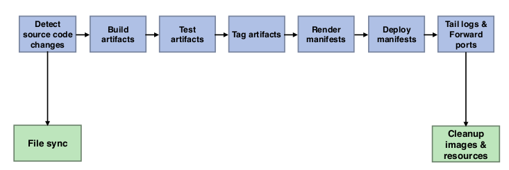

# Skaffold
* Skaffold is an open source project from Google
* It’s a command line tool for continuous development of applications that can run on Kubernetes

* Skaffold will handle
  * Building, for example with docker build
  * Pushing, to docker hub or other repositories
  * Deploying, to your Kubernetes cluster

* Having this workflow, Skaffold can monitor your application for changes while you are developing it
* When a change happens, it can execute this build/push/deploy workflow to get your application deployed immediately to the Kubernetes cluster
* That way you can very quickly iterate on your application
* Skaffold can also be used as a tool that can be incorporated into your CI/CD pipeline, as it has the build/push/deploy workflow built-in

  * That way you can have the workflow locally to test your app, and have it handled by your CI/CD in the same way

##### Skaffold is very pluggable:
* You can do the build with a local docker installation, or with alternatives like in-cluster build with Kaniko or even a remote build on Google Cloud Build
* Other builds next to docker are also possible, like Bazel, build packs or custom builds
* Deploying can be done with kubectl (simplest way), helm is also a possibility

##### Skaffold pipeline stages

