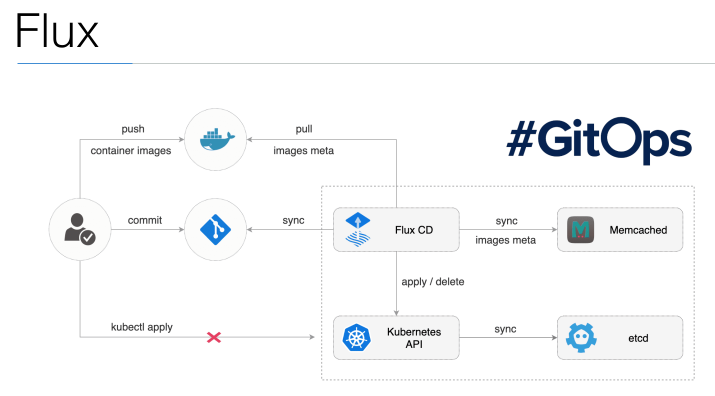

# Flux

* Flux automates the deployment of containers to Kubernetes

* It can synchronise your version control (git) and your Kubernetes cluster

  * With flux, you can put manifest files (your kubernetes yaml files) within your git repository
  * Flux will monitor this repository and make sure that what’s in the manifest files is deployed to the cluster

* Flux also has interesting features where it can automatically upgrade your containers to the latest version available within your docker repository (it uses semantic versioning for that - e.g. “~1.0.0”)

