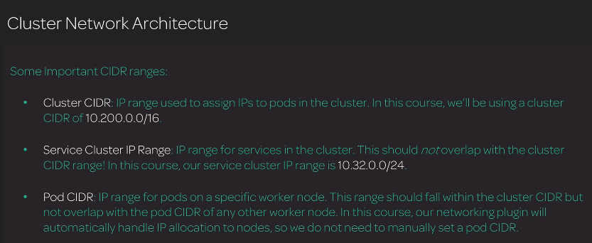

# Cluster Network Architecture

* Cluster CIDR: là một IP range được sử dụng để gán IP address tới các Pods trong một cluster. ví dụ dùng dải IP 10.200.0.0/16 để gán IP cho các Pos (có thể gán 255 * 255 - 2 địa chỉ cho các Pods dải IP 10.200.0.0/16)
* Service CIDR: là một dải IP range được sử dụng trong cluster.
- Không nên để bị trùng với cluster CIDR range (ví dụ dùng dải 10.32.0.0/24 hoàn toàn không trùng với dải 10.200.0.0/16)
* Pod CIDR: Ip range cho pods trong một worker node cụ thể. Pod CIDR lấy từ cluster CIDR nhưng  nó sẽ không trùng với các IP của clusters.
