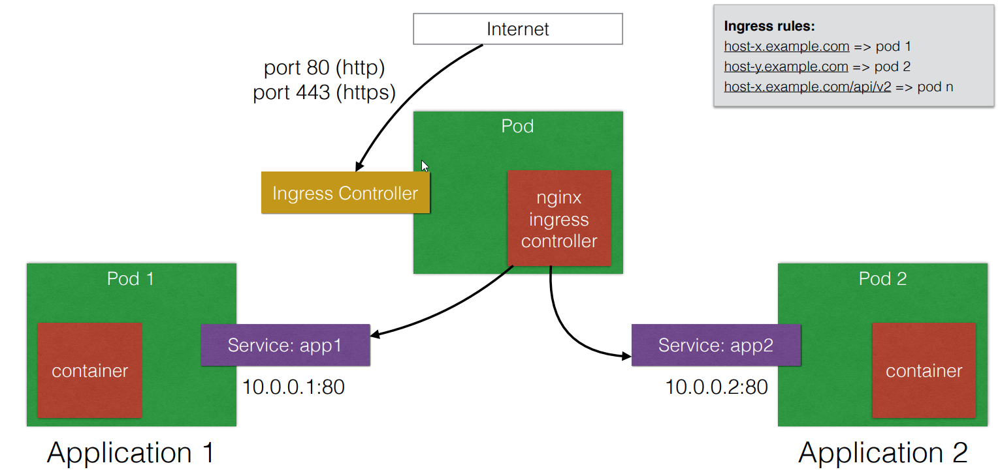

# Ingress
* Ta có thể dụng ingress controller để giảm sự phụ thuộc vào Loadbalancer (reduce cost of Loadbalancer)
  - Ta có thể dùng chỉ một Loadbalancer để bắt tất cả các external traffic và gửi nó tới ingress controller
  - ingress controller có thể được cấu hình để route different traffic tới tất cả apps based on HTTP rules(host and prefixes)
  - Ingress chỉ hoạt động với HTTP(s)-based applications


* Ingress là một giải pháp cho cho phép inbound connection tới cluster
* Nó có thể thay thế cho Loadbalancer và nodePorts
  - Ingress cho phép ta dễ dàng expose những services cần được access từ outside tới cluster
* Với ingress, ta có thể chạy ingress controller(cơ bản giống Loadbalancer) bên trong kubernetes cluster
* Có sẽ default ingress controller hoặc ta có thể tự viết ingress controller riêng

### Biểu đồ thể hiện cách hoạt động của ingress




### Tạo các rules ingress

```
apiVersion: extensions/v1beta1
kind: Ingress
metadata:
 name: helloworld-rules
spec:
 rules:
 - host: helloworld-v1.example.com
 http:
 paths:
 - path: /
 backend:
 serviceName: helloworld-v1
 servicePort: 80
 - host: helloworld-v2.example.com
 http:
 paths:
 - path: /
 backend:
 serviceName: helloworld-v2
 servicePort: 80
```

-> Với các host cụ thể, ingress sẽ điều hướng đến path backend của host đó
