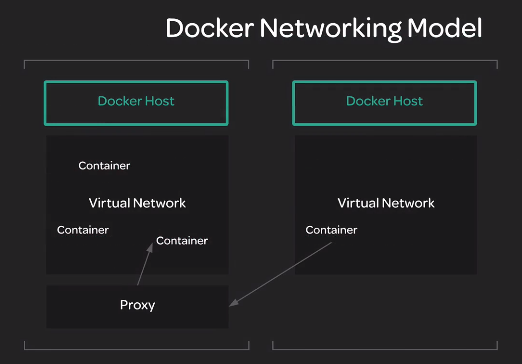
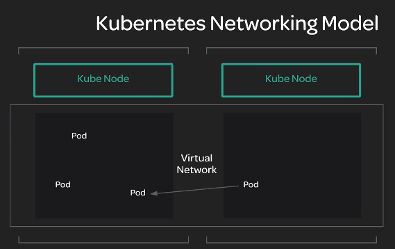

# Kubernetes Networking Model

[Official docs](https://kubernetes.io/docs/concepts/cluster-administration/networking/)

### Những vấn đề mà Kubernetes Networking Model có thể giải quyết?
* container sẽ giao tiếp với nhau như thế nào?
* Sẽ ra sao nếu container ở các hosts(worker nodes) khác nhau?
* container communicate với services như thế nào?
* Các containers được gán unique IP addresses như thế nào? Port(s) nào sẽ được sử dụng?

### Trước tiên ta sẽ tìm hiểu về Docker(container runtime) Model:
Docker cho phép containers communicate với nhau sử dụng virtual network bridge được cấu hình trên host.

  Mỗi host có virtual network riêng của nó phục vụ tất cả container trong host.(self-contain virtual n)

→ Vấn đề xảy ra nếu containers ở trên host khác nhau → ta phải setup proxy traffic từ host tới các containers, phải đảm bảo 2 containers KHÔNG dùng chung port trên host → trong hệ thống lớn với rất nhiều container → làm cho hệ thống trở lên phức tạp

Kubernetes networking model được tạo ra để giải quyết vấn đề trên. Nó được thiết kế để cải tiến các giới hạn của Docker model

Như ảnh trên có thể thấy ta có 2 hosts, mỗi host có một Virtual Network hoàn toàn riêng biệt → 2 Virtual Network riêng biệt không thể nói chuyện với nhau → ta cần tạo thêm một proxy trung gian giữa 2 con

→ Ví dụ nếu ta có thêm 3 hosts → cần tạo thêm 3 proxy → với hệ thống lớn → trở lên rất phức tạp để quản lý.

### Kubernetes Networking Model
* Tạo MỘT Virtual Network cho toàn bộ cluster(span across all the hosts)
* Mỗi pod có unique IP bên trong một cluster
* mỗi service có Unique IP address, IP range của service khác biệt với IP range của pod(dải IP riêng cho pods và dải IP riêng cho services)
→ Một Pod có thể connect tới các pod khác không quan trọng nó đang ở host nào, cũng có thể connect tới các services miễn là ta biết địa chỉ IP của chúng.

Như ảnh trên ta thấy 2 Node có 2 Network riêng biệt nhưng có chung 1 Virtual Network
