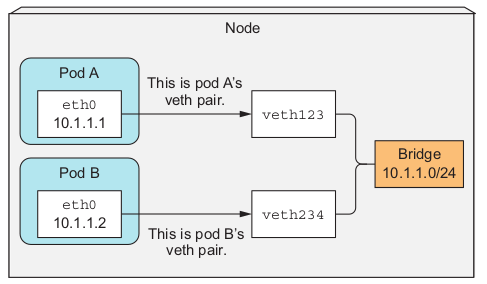

# Inter-Pod networking
By now, you know that each pod gets its own unique IP address and can communicate
with all other pods through a flat, NAT-less network. How exactly does Kubernetes
achieve this? In short, it doesn’t. The network is set up by the system administrator or
by a Container Network Interface (CNI) plugin, not by Kubernetes itself.
# What the network must be like 
Kubernetes doesn’t require you to use a specific networking technology, but it does
mandate that the pods (or to be more precise, their containers) can communicate
with each other, regardless if they’re running on the same worker node or not. The
network the pods use to communicate must be such that the IP address a pod sees as
its own is the exact same address that all other pods see as the IP address of the pod in
question.

Look at figure below. When pod A connects to (sends a network packet to) pod B,
the source IP pod B sees must be the same IP that pod A sees as its own. There should
be no network address translation (NAT) performed in between—the packet sent by
pod A must reach pod B with both the source and destination address unchanged.

Kubernetes mandates pods are connected through a NAT-less network

This is important, because it makes networking for applications running inside pods
simple and exactly as if they were running on machines connected to the same net-
work switch. The absence of NAT between pods enables applications running inside
them to self-register in other pods.

For example, say you have a client pod X and pod Y, which provides a kind of noti-
fication service to all pods that register with it. Pod X connects to pod Y and tells it,
“Hey, I’m pod X, available at IP 1.2.3.4; please send updates to me at this IP address.”
The pod providing the service can connect to the first pod by using the received
IP address.

The requirement for NAT-less communication between pods also extends to pod-
to-node and node-to-pod communication. But when a pod communicates with ser-
vices out on the internet, the source IP of the packets the pod sends does need to be
changed, because the pod’s IP is private. The source IP of outbound packets is
changed to the host worker node’s IP address.

Building a proper Kubernetes cluster involves setting up the networking according
to these requirements. There are various methods and technologies available to do
this, each with its own benefits or drawbacks in a given scenario. Because of this, we’re
not going to go into specific technologies. Instead, let’s explain how inter-pod net-
working works in general.
# Diving deeper into how networking work
We saw that a pod’s IP address and network namespace are set up and
held by the infrastructure container (the pause container). The pod’s containers then
use its network namespace. A pod’s network interface is thus whatever is set up in the
infrastructure container. Let’s see how the interface is created and how it’s connected
to the interfaces in all the other pods. Look at figure below. We’ll discuss it next.

Pods on a node are connected to the same bridge through virtual Ethernet interface pairs.

### ENABLING COMMUNICATION BETWEEN PODS ON THE SAME NODE
Before the infrastructure container is started, a virtual Ethernet interface pair (a veth
pair) is created for the container. One interface of the pair remains in the host’s
namespace (you’ll see it listed as vethXXX when you run ifconfig on the node),
whereas the other is moved into the container’s network namespace and renamed
eth0 . The two virtual interfaces are like two ends of a pipe (or like two network
devices connected by an Ethernet cable)—what goes in on one side comes out on the
other, and vice-versa.

The interface in the host’s network namespace is attached to a network bridge that
the container runtime is configured to use. The eth0 interface in the container is
assigned an IP address from the bridge’s address range. Anything that an application
running inside the container sends to the eth0 network interface (the one in the con-
tainer’s namespace), comes out at the other veth interface in the host’s namespace
and is sent to the bridge. This means it can be received by any network interface that’s
connected to the bridge.

If pod A sends a network packet to pod B, the packet first goes through pod A’s
veth pair to the bridge and then through pod B’s veth pair. All containers on a node
are connected to the same bridge, which means they can all communicate with each
other. But to enable communication between containers running on different nodes,
the bridges on those nodes need to be connected somehow.
### ENABLING COMMUNICATION BETWEEN PODS ON DIFFERENT NODES
You have many ways to connect bridges on different nodes. This can be done with
overlay or underlay networks or by regular layer 3 routing, which we’ll look at next.
You know pod IP addresses must be unique across the whole cluster, so the bridges
across the nodes must use non-overlapping address ranges to prevent pods on differ-
ent nodes from getting the same IP. In the example shown in figure 11.16, the bridge
on node A is using the 10.1.1.0/24 IP range and the bridge on node B is using
10.1.2.0/24, which ensures no IP address conflicts exist.

Figure below shows that to enable communication between pods across two nodes
with plain layer 3 networking, the node’s physical network interface needs to be con-
nected to the bridge as well. Routing tables on node A need to be configured so all
packets destined for 10.1.2.0/24 are routed to node B, whereas node B’s routing
tables need to be configured so packets sent to 10.1.1.0/24 are routed to node A.
With this type of setup, when a packet is sent by a container on one of the nodes
to a container on the other node, the packet first goes through the veth pair, then

For pods on different nodes to communicate, the bridges need to be connected somehow

through the bridge to the node’s physical adapter, then over the wire to the other
node’s physical adapter, through the other node’s bridge, and finally through the veth
pair of the destination container.

This works only when nodes are connected to the same network switch, without
any routers in between; otherwise those routers would drop the packets because
they refer to pod IPs, which are private. Sure, the routers in between could be con-
figured to route packets between the nodes, but this becomes increasingly difficult
and error-prone as the number of routers between the nodes increases. Because of
this, it’s easier to use a Software Defined Network (SDN), which makes the nodes
appear as though they’re connected to the same network switch, regardless of the
actual underlying network topology, no matter how complex it is. Packets sent
from the pod are encapsulated and sent over the network to the node running the
other pod, where they are de-encapsulated and delivered to the pod in their origi-
nal form.
# Introducing Container Network Interface (CNI)
To make it easier to connect containers into a network, a project called Container
Network Interface (CNI) was started. The CNI allows Kubernetes to be configured to
use any CNI plugin that’s out there. These plugins include
* Calico
* Flannel
* Romana
* Weave Net
* Others

We’re not going to go into the details of these plugins; if you want to learn more about
them, refer to https://kubernetes.io/docs/concepts/cluster-administration/addons/.
Installing a network plugin isn’t difficult. You only need to deploy a YAML con-
taining a DaemonSet and a few other supporting resources. This YAML is provided
on each plugin’s project page. As you can imagine, the DaemonSet is used to deploy
a network agent on all cluster nodes. It then ties into the CNI interface on the node,
but be aware that the Kubelet needs to be started with --network-plugin=cni to
use CNI.