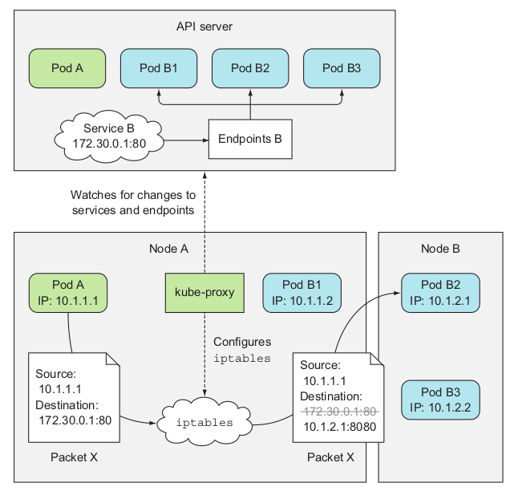

# How kube-proxy use iptables
When a service is created in the API server, the virtual IP address is assigned to it
immediately. Soon afterward, the API server notifies all kube-proxy agents running on
the worker nodes that a new Service has been created. Then, each kube-proxy makes
that service addressable on the node it’s running on. It does this by setting up a few
iptables rules, which make sure each packet destined for the service IP/port pair is
intercepted and its destination address modified, so the packet is redirected to one of
the pods backing the service.
Besides watching the API server for changes to Services, kube-proxy also watches
for changes to Endpoints objects. We talked about them in chapter 5, but let me
refresh your memory, as it’s easy to forget they even exist, because you rarely create
them manually. An Endpoints object holds the IP/port pairs of all the pods that back
the service (an IP/port pair can also point to something other than a pod). That’s
why the kube-proxy must also watch all Endpoints objects. After all, an Endpoints
object changes every time a new backing pod is created or deleted, and when the
pod’s readiness status changes or the pod’s labels change and it falls in or out of scope
of the service.
Now let’s see how kube-proxy enables clients to connect to those pods through the
Service. This is shown in figure 11.17.
The figure shows what the kube-proxy does and how a packet sent by a client pod
reaches one of the pods backing the Service. Let’s examine what happens to the
packet when it’s sent by the client pod (pod A in the figure).
The packet’s destination is initially set to the IP and port of the Service (in the
example, the Service is at 172.30.0.1:80). Before being sent to the network, the

packet is first handled by node A’s kernel according to the iptables rules set up on
the node.
The kernel checks if the packet matches any of those iptables rules. One of them
says that if any packet has the destination IP equal to 172.30.0.1 and destination port
equal to 80, the packet’s destination IP and port should be replaced with the IP and
port of a randomly selected pod.
The packet in the example matches that rule and so its destination IP/port is
changed. In the example, pod B2 was randomly selected, so the packet’s destination
IP is changed to 10.1.2.1 (pod B2’s IP) and the port to 8080 (the target port specified
in the Service spec). From here on, it’s exactly as if the client pod had sent the packet
to pod B directly instead of through the service.
It’s slightly more complicated than that, but that’s the most important part you
need to understand.