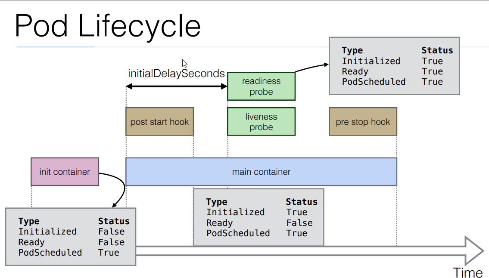

* init container: ta có thể launch new container tách biệt khỏi main container để thực hiện vài command trước khi main container khởi động
  - main container chỉ khởi động sau khi init container được tạo

* main container:
  - post start hook
  - pre stop hook: command sẽ được thực thi trước khi container tiến hành stop
  - readiness probe và liveness probe:
    - sau initalDelaySecond, chúng sẽ chạy, kiểm tra liệu application có đang hoạt động hay không
