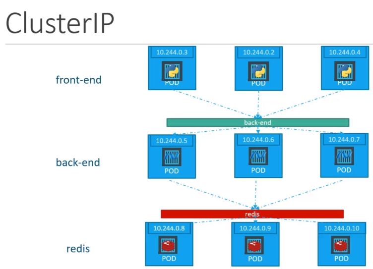

# Cluster IP

Service create a virtual IP inside cluster to enable communication between services. Such as, a set of frontend to a set of backend servers.

A full stack web application typically has  different kinds of pods hosting different parts of an application.

You may have a number of pods running a front end web server another set of pods running a back endserver, a set of PODs running a key-value store like Redis, another set of PODs running a persistent  database like MySQL. The web front end server needs to communicate to the back end servers and the backend-workers need to connect to database as well as the redis services etc..

So what is the right way to establish connectivity between these services or tiers of my application.

**The pods all have an IP address assigned to them as we can see on the screen but these IP as we know are not static.**

**These pods can go down any time and new pods are created all the time.**

And so you cannot rely on these IP addresses for internal communication between the application.Also what if the first front-end POD at 10.244.0.3 need to connect to a backend service? Which of the three would it go to and who makes that decision.

A kubernetes service can help us group these PODs together and provide a single interface to access  the PODs in a group. 

**For example a service created for the backend PODs will help group all the backend PODs together and provide a single interface for other PODs to access this service. The requests are forwarded to one of the PODs under the service randomly.**

Similarly create additional services for Redis and allow the backend parts to access the redis systems through the service.

This enables us to easily and effectively deploy a microservices based application on kubernetes cluster. Each layer can now scale or move as required without impacting communication between the various services.

Each service gets an IP name assigned to it inside the cluster and that is the name that should be used by other pods to access the service.

This type of service is known as cluster IP to create such a service as always use a definition file in the service definition file first used to default template which has API version kind.

Metadata and spec the API version is V1 kind is a service and we will give a name to our service.

We will call it backend under specification we have type and ports the type is cluster IP in fact cluster

IP is the default type.

So even if you didn't specify it it will automatically assume the type to be cluster IP under ports.

We have a target port and port the target port is the port where the backend is exposed which in this

case is 80 and the port is where the service is exposed which is 80 as well.

To link the service to a set of pods we use selector we will refer to the pod definition file and

copy the labels from it and remove it under selector and that should be it.