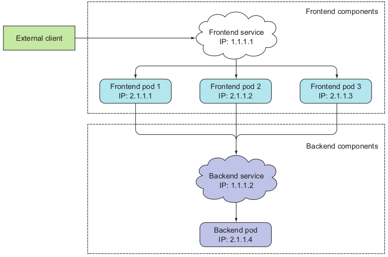
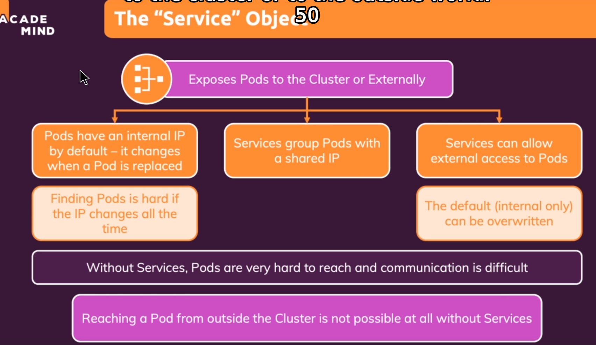

# Services
* Khi sử dụng Replication Controller, pods được terminated và được created trong quá trình scaling
* Khi sử dụng Deployments, Khi updating image version, pods được terminated và pods mới sẽ thay thế cho pods cũ
-> không bao giờ nên access pods trực tiếp, luôn luôn phải thông qua Service

* Một Service là một logical bridge giữa "mortal" pods và các Services hoặc end-users khác


* Khi sử dụng câu lệnh "kubectl expose", ta tạo new Service cho pod, từ đó ta có thể access pod externally
* Tạo một Service sẽ tạo một endpoint cho pods:
  -  ClusterIP: một virtual IP address chỉ có thể reachable từ bên trong cluster(default)
  -  NodePort: port is the same on each node that is also reachable externally
  -  LoadBalancer:
    - được sử dụng cho production applications trên cloud
    - route external traffic tới tất cả các node trên NodePort

### DNS names
* ExternalName có thể cung cấp DNS name cho Service
  - ví dụ Service discovery sử dụng DNS
  - Chỉ hoạt động khi DNS add-on được enabled


### Ví dụ của một Service definition
* Ta cũng có thể dùng câu lệnh kubectl expose(chức năng tương tự như việc khai báo service ở dưới)
```
apiVersion: v1
kind: Service
metadata:
 name: helloworld-service
spec:
 ports:
 - port: 31001
# Ta có thể khai báo nodePort hoặc không(optional), nếu ta không khai báo, nó sẽ tự động gán một random nodePort, khai báo không được phép trùng port với nodePort khác
 nodePort: 31001
 targetPort: nodejs-port
 protocol: TCP
 selector:
 app: helloworld
 type: NodePort
 ```


* Lưu ý: Mặc định service chỉ có thể chạy trên khoảng ports: 30000-32767, nhưng ta cũng có thể tùy biến lại bằng cách sử dụng:
  - Argument "--service-node-port-range=" cho kube-apiserver (init scripts)
