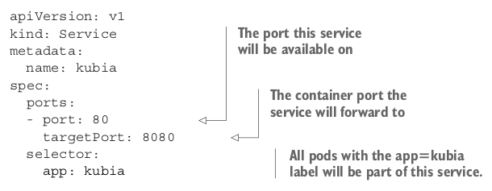

# CREATING A SERVICE THROUGH A YAML DESCRIPTOR



You’re defining a service called kubia , which will accept connections on port 80 and
route each connection to port 8080 of one of the pods matching the app=kubia
label selector.
Go ahead and create the service by posting the file using kubectl create .

# EXAMINING YOUR NEW SERVICE

After posting the YAML, you can list all Service resources in your namespace and see that an internal cluster IP has been assigned to your service:


The list shows that the IP address assigned to the service is 10.111.249.153. Because
this is the cluster IP, it’s only accessible from inside the cluster. The primary purpose
of services is exposing groups of pods to other pods in the cluster, but you’ll usually
also want to expose services externally. You’ll see how to do that later. For now, let’s
use your service from inside the cluster and see what it does.

# EXPOSING MULTIPLE PORTS IN THE SAME SERVICE
Your service exposes only a single port, but services can also support multiple ports. For
example, if your pods listened on two ports—let’s say 8080 for HTTP and 8443 for
HTTPS—you could use a single service to forward both port 80 and 443 to the pod’s
ports 8080 and 8443. You don’t need to create two different services in such cases. Using
a single, multi-port service exposes all the service’s ports through a single cluster IP.

```
NOTE:
When creating a service with multiple ports, you must specify a name
for each port.
```
