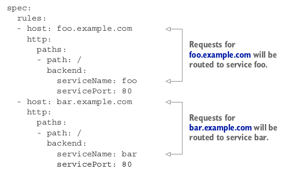

# Exposing multiple services through the same Ingress
If you look at the Ingress spec closely, you’ll see that both rules and paths are arrays,
so they can contain multiple items. An Ingress can map multiple hosts and paths to
multiple services, as you’ll see next. Let’s focus on paths first.

### MAPPING DIFFERENT SERVICES TO DIFFERENT PATHS OF THE SAME HOST
You can map multiple paths on the same host to different services, as shown in the
following listing.

Requests received by the controller will be forwarded to either service foo or bar ,
depending on the Host header in the request (the way virtual hosts are handled in
web servers). DNS needs to point both the foo.example.com and the bar.exam-
ple.com domain names to the Ingress controller’s IP address.
