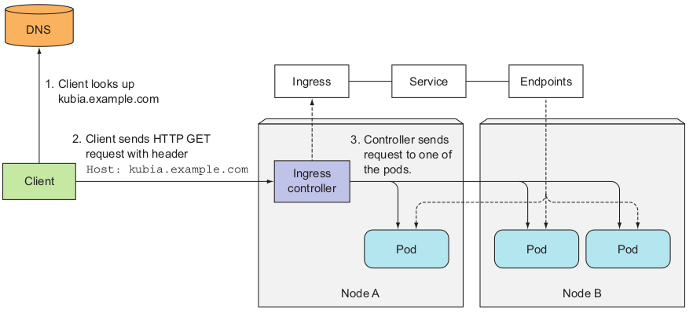

# UNDERSTANDING HOW INGRESSES WORK
Figure below shows how the client connected to one of the pods through the Ingress
controller. The client first performed a DNS lookup of kubia.example.com, and the
DNS server (or the local operating system) returned the IP of the Ingress controller.
The client then sent an HTTP request to the Ingress controller and specified
kubia.example.com in the Host header. From that header, the controller determined
which service the client is trying to access, looked up the pod IPs through the End-
points object associated with the service, and forwarded the client’s request to one of
the pods.
As you can see, the Ingress controller didn’t forward the request to the service. It
only used it to select a pod. Most, if not all, controllers work like this.
