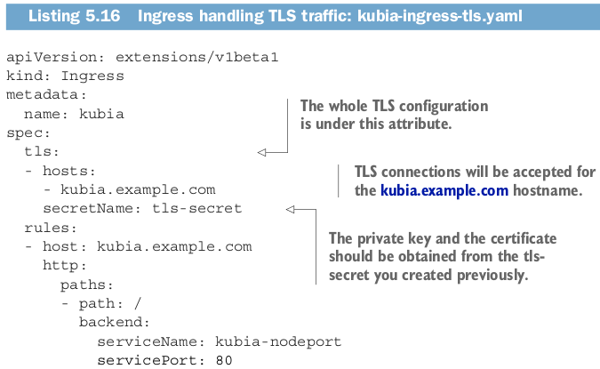

# Configuring Ingress to handle TLS traffic
You’ve seen how an Ingress forwards HTTP traffic. But what about HTTPS? Let’s take
a quick look at how to configure Ingress to support TLS.
### CREATING A TLS CERTIFICATE FOR THE INGRESS
When a client opens a TLS connection to an Ingress controller, the controller termi-
nates the TLS connection. The communication between the client and the controller
is encrypted, whereas the communication between the controller and the backend
pod isn’t. The application running in the pod doesn’t need to support TLS. For exam-
ple, if the pod runs a web server, it can accept only HTTP traffic and let the Ingress
controller take care of everything related to TLS. To enable the controller to do that,
you need to attach a certificate and a private key to the Ingress. The two need to be
stored in a Kubernetes resource called a Secret, which is then referenced in the
Ingress manifest. We’ll explain Secrets in detail in chapter 7. For now, you’ll create the
Secret without paying too much attention to it.
```
First, you need to create the private key and certificate:
$ openssl genrsa -out tls.key 2048
$ openssl req -new -x509 -key tls.key -out tls.cert -days 360 -subj
➥ /CN=kubia.example.com
```

```
Then you create the Secret from the two files like this:
kubectl create secret tls tls-secret --cert=tls.cert --key=tls.key
secret "tls-secret" created
```

### Signing certificates through the CertificateSigningRequest resource
```
Instead of signing the certificate ourselves, you can get the certificate signed by
creating a CertificateSigningRequest (CSR) resource. Users or their applications
can create a regular certificate request, put it into a CSR, and then either a human
operator or an automated process can approve the request like this:
$ kubectl certificate approve <name of the CSR>
The signed certificate can then be retrieved from the CSR’s status.certificate
field.
Note that a certificate signer component must be running in the cluster; otherwise
creating CertificateSigningRequest and approving or denying them won’t have
any effect.
```
The private key and the certificate are now stored in the Secret called tls-secret .
Now, you can update your Ingress object so it will also accept HTTPS requests for
kubia.example.com. The Ingress manifest should now look like the following listing.

```
TIP
Instead of deleting the Ingress and re-creating it from the new file, you
can invoke kubectl apply -f kubia-ingress-tls.yaml , which updates the
Ingress resource with what’s specified in the file.
```
You can now use HTTPS to access your service through the Ingress:
```
$ curl -k -v https://kubia.example.com/kubia
* About to connect() to kubia.example.com port 443 (#0)
...
* Server certificate:
*
subject: CN=kubia.example.com
...
> GET /kubia HTTP/1.1
> ...
You've hit kubia-xueq1
```
The command’s output shows the response from the app, as well as the server certifi-
cate you configured the Ingress with.
```
NOTE
Support for Ingress features varies between the different Ingress con-
troller implementations, so check the implementation-specific documenta-
tion to see what’s supported.

```
Ingresses are a relatively new Kubernetes feature, so you can expect to see many
improvements and new features in the future. Although they currently support only
L7 (HTTP/HTTPS) load balancing, support for L4 load balancing is also planned.