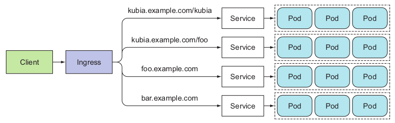
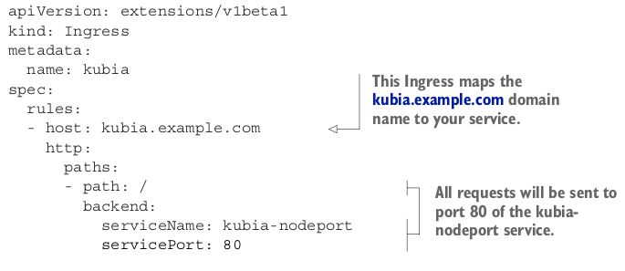

# UNDERSTANDING WHY INGRESSES ARE NEEDED
One important reason is that each LoadBalancer service requires its own load bal-
ancer with its own public IP address, whereas an Ingress only requires one, even when
providing access to dozens of services. When a client sends an HTTP request to the
Ingress, the host and path in the request determine which service the request is for-
warded to, as shown in figure below


Multiple services can ve exposed throught a single Ingress

Ingresses operate at the application layer of the network stack (HTTP) and can provide features such as cookie-based session affinity and the like, which services can’t.

# UNDERSTANDING THAT AN INGRESS CONTROLLER IS REQUIRED
Before we go into the features an Ingress object provides, let me emphasize that to
make Ingress resources work, an Ingress controller needs to be running in the cluster.
Different Kubernetes environments use different implementations of the controller,
but several don’t provide a default controller at all.
For example, Google Kubernetes Engine uses Google Cloud Platform’s own HTTP
load-balancing features to provide the Ingress functionality. Initially, Minikube didn’t
provide a controller out of the box, but it now includes an add-on that can be enabled
to let you try out the Ingress functionality. Follow the instructions in the following
sidebar to ensure it’s enabled.

# Creating an Ingress resource

You’ve confirmed there’s an Ingress controller running in your cluster, so you can
now create an Ingress resource. The following listing shows what the YAML manifest
for the Ingress looks like.


This defines an Ingress with a single rule, which makes sure all HTTP requests received
by the Ingress controller, in which the host kubia.example.com is requested, will be
sent to the kubia-nodeport service on port 80 .
```
NOTE Ingress controllers on cloud providers (in GKE, for example) require
the Ingress to point to a NodePort service. But that’s not a requirement of
Kubernetes itself.
```
