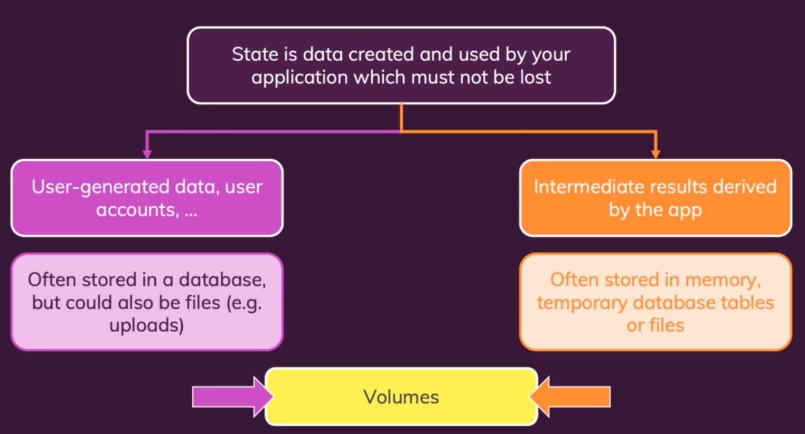
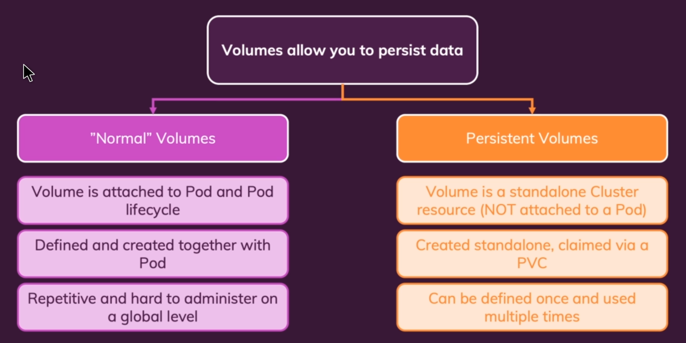

# Volume and Persistent Volume

### State

* Với những dữ liệu như user-generated data, user account,.. ta nên lưu ở trong persistent data

* Với những dữ liệu tạm thời được tạo ra bởi app trong pod, ta nên lưu tại volume trong pod (dù pod có bị xóa dữ liệu bị mất theo không gây ảnh hưởng nhiều)

### So sánh Volume và Persistent Volume
