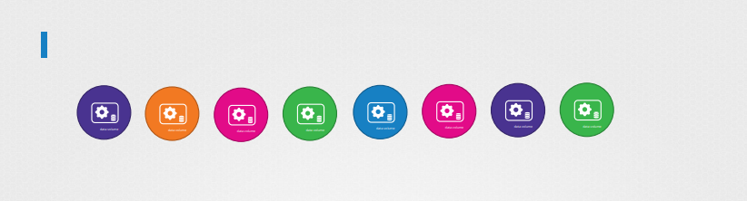
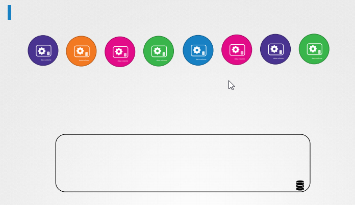
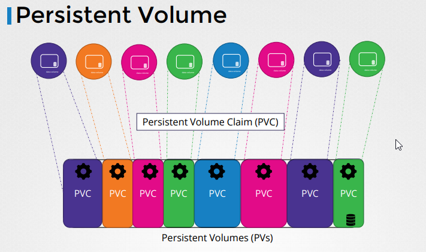
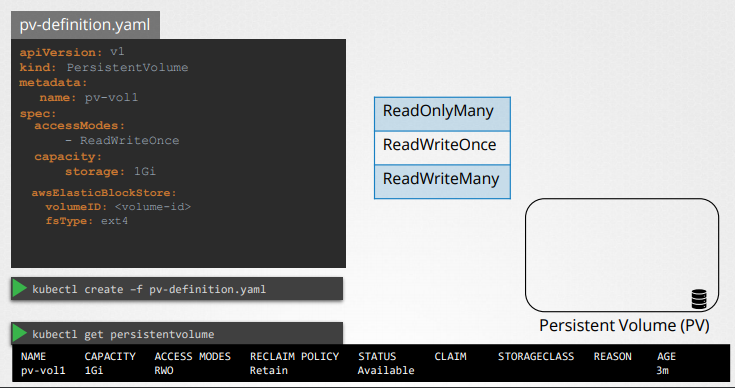
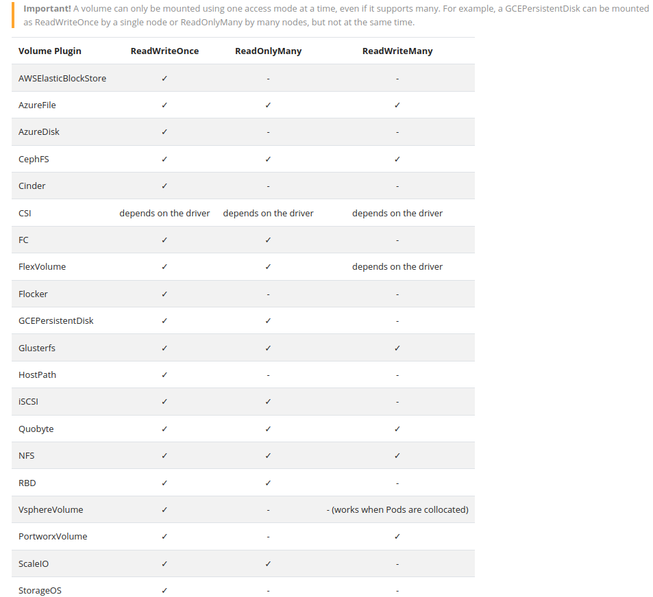

# Persistent Volume




Khi ta làm việc với large environment với rất nhiều user deploy rất nhiều pods, users phải cấu hình storage mỗi lần cho mỗi pod.




Để quản lý tập trung storage, ta sẽ cấu hình một large pool of storage và sau đó chia thành nhiều pool nhỏ cho user dùng.

-> Persistent volumes có thể giúp ta làm điều trên.



A persistent volume is a cluster wide pool of storage volumes configured by an administrator to be used by users deploying applications on the Cluster.
The users can now select storage from this pool using ** persistent volume claims** let us now create a persistent volume.

Một persistent volume là một cluster wide pool of storage volumes được cấu hình bởi người quản trị. Nó được sử dụng bởi các users để deploy apps trên cluster

User có thể chọn storage 
### Example config persistent volume

                      

### [Access Modes](https://kubernetes.io/docs/concepts/storage/persistent-volumes/#access-modes)
```
apiVersion: v1
kind: PersistentVolume
metadata:
  name: host-pv
spec:
  capacity:
    storage: 1Gi
  volumeMode: Filesystem
  accessModes:
    - ReadWriteOnce
    - ReadOnlyMany
    - ReadWriteMany
  hostPath:
    path: /data
    type: DirectoryOrCreate
```

Ta có thể thấy có 3 access modes
* ReadWriteOnce
  * volume có thể được mounted như là một read-write volume bởi chỉ 1 sigle Node
  * Có thể mount trên multiple pod nhưng chỉ được claim trên cùng 1 Node
* ReadOnlyMany
  * Read Only
  * Có thể được claim trên multiple Node
  * multiple pod trên các Nodes khác nhau có thể  claim loại volume này
* ReadWriteMany
  * Read-Write access
  * còn lại giống với ReadOnlyMany



### volumeMode
Kubernetes supports two volumeModes of PersistentVolumes: Filesystem and Block.

volumeMode is an optional API parameter. Filesystem is the default mode used when volumeMode parameter is omitted.

A volume with volumeMode: Filesystem is mounted into Pods into a directory. If the volume is backed by a block device and the device is empty, Kuberneretes creates a filesystem on the device before mounting it for the first time.

You can set the value of volumeMode to Block to use a volume as a raw block device. Such volume is presented into a Pod as a block device, without any filesystem on it. This mode is useful to provide a Pod the fastest possible way to access a volume, without any filesystem layer between the Pod and the volume. On the other hand, the application running in the Pod must know how to handle a raw block device. See Raw Block Volume Support for an example on how to use a volume with volumeMode: Block in a Pod