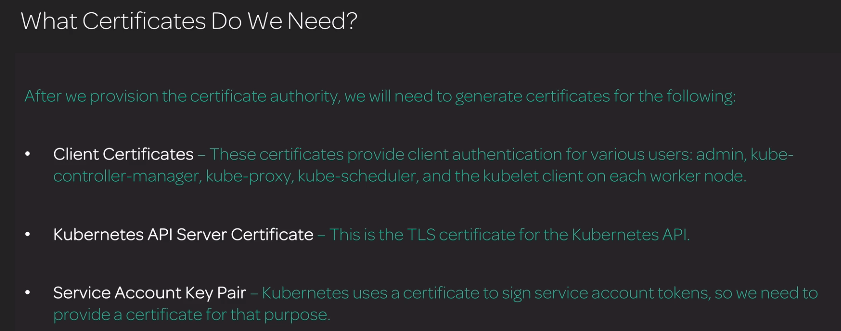

# Tại sao lại cần CA và TLS Certificates

Certificates được sử dụng để confirm(authenticate) identity, Nó như là một phiên bản phức tạp hơn của xác thực password.

Một CA(Certificate Authority) cung cấp khả năng để xác thực rằng một certificate là valid.

Một Certificate Authority có thể được sử dụng để validate bất kỳ certificate nào mà được phát hành bởi Certificate Author đó.

Kubernets sử dụng certificate cho phần lớn security functions và các component khác nhau

# Ta cần những Certificate nào?

* Client Certificate:
  - Client certificate như là một password
  - Tất cả các component trên nhiều server đều cần phải authenticate sercurely với Kubernetes API và ta sẽ dung Client certificate để làm điều đó

* Kubernetes API Server Certificate:
  - Khi Client Certificate nói chuyện với Kubernetes API, Client sẽ dùng certificate để xác thực chính nó với Kubernetes API

  - Kubenetes API sẽ dùng certificate của nó để xác thực no la Kubernetes API server

* Service Account Key Pair:
  - Tạo token cho phép user authenticate sử dụng service
